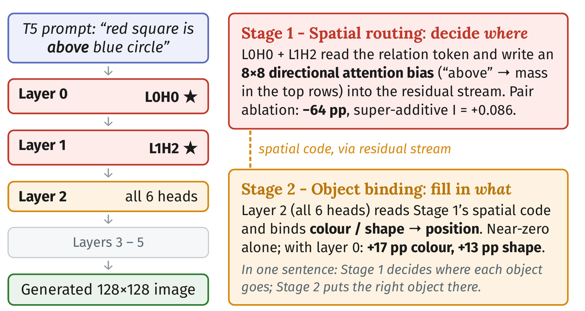
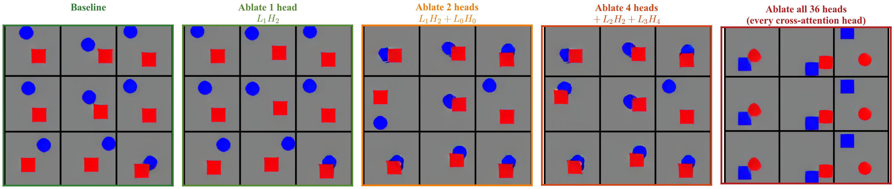

# Mech interp for image diffusion transformers!

Code, notebooks, and figures for our paper **A Two-Stage Cross-Attention Circuit for Spatial-Relation Binding in Small Diffusion Transformers**, presented at the ICML 2026 Mechanistic Interpretability workshop.

[**Poster (PDF)**](ICML_MechInterp_Poster.pdf)

## Motivation

Text-to-image diffusion transformers can place objects correctly: ask for "a red square above a blue circle" and the red square ends up on top. But how a model turns a relation word like "above" into actual image layout has not been worked out at the level of individual components. Most interpretability work on these models stops at attention-map attribution or points to whole blocks; almost all head-level circuit analysis so far has been done on language models, not image generators.

We wanted to know whether the same kind of head-level circuit story that people tell about language models also holds for a diffusion transformer, and whether we could pin a specific, nameable computation to specific heads and back it up causally. To make that tractable we work in a small, fully-enumerable setting: a 6-layer PixArt-mini with 36 cross-attention heads, trained on synthetic two-object scenes with eight spatial relations. Small enough to ablate every head, real enough that the mechanism should generalize in spirit.

## What we found

The computation splits into two stages: two early heads decide *where* each object goes, and Layer 2 fills in *what* goes there.




- **Spatial routing lives in two early heads.** Two heads, `L0H0` and `L1H2` in layers 0 and 1, carry almost all of the spatial signal. Their query-key circuits turn the relation token into a directional bias over the image grid (for "above", weight lands on the top rows). Zeroing `L0H0` alone drops spatial accuracy from 0.84 to 0.35; zeroing both drops it to 0.20, a super-additive effect that a four-way search shows no other head reproduces.

- **Object binding is a separate, distributed stage.** A second stage in Layer 2 binds color and shape to the positions that Layer 0/1 laid out. No single Layer-2 head does much on its own, but co-ablating Layer 2 with Layer 0 damages color and shape far more than either alone.

- **You only see the binding stage if you score the right metric.** Pair-ablation scored on spatial accuracy alone says the binding stage does not exist, because spatial accuracy ignores which object is where. Scoring color and shape separately makes it appear. Single-metric ablation can quietly miss a whole downstream stage, which is a trap for circuit work in general, not just here.

- **The circuit snaps into place.** Across training, the routing heads' projection strength jumps by about three orders of magnitude in a sharp phase transition around epochs 750 to 1000, and behavioral accuracy follows roughly 200 epochs later. Retraining on additional seeds reproduces both the sharp transition and the early-layer localization, though which exact head takes the role shifts from run to run.

You can watch the layout fall apart as heads are removed: dropping `L1H2` alone changes almost nothing, dropping both routing heads makes the two objects collide, and removing all cross-attention destroys the layout entirely while the shapes themselves survive.



See [`figures/`](figures/) for the full set of paper figures and [`results/`](results/) for the per-experiment CSVs behind them. Neither requires the heavy training assets.

## Repository layout

```
├── src/          # model loading, evaluation, ablation hooks, alignment scan
├── notebooks/    # walkthroughs: head discovery, ablation/causality, variance partition
├── scripts/      # standalone reproduction scripts (multi-seed retrain + emergence)
├── results/      # per-experiment result CSVs
├── figures/      # paper figures (PDF + PNG)
└── PixArt-alpha/ # vendored DiT model code
```

The three notebooks trace the discovery pipeline end to end: alignment scan over all 36 heads, zero/pair/triple ablation, and the variance-partition geometry. `scripts/multiseed/` retrains from scratch on new seeds and re-runs the emergence analysis; each script's `--help` documents its arguments.

## Setup

Tested on macOS (MPS) and Linux (CUDA).

```bash
python -m venv .venv && source .venv/bin/activate
pip install -r requirements.txt
```

The committed figures and CSVs stand alone. Rerunning the notebooks or training needs the model checkpoints, the T5 embedding cache, and the synthetic dataset, which are too large for GitHub; contact the authors for access. Everything fits on a single 80 GB GPU (PixArt-mini inference uses about 3 GB).

## Licenses

Code is MIT (see [`LICENSE`](LICENSE)). Trained weights and synthetic data are CC-BY-4.0. Vendored PixArt-alpha code is AGPL-3.0. T5-XXL is Apache-2.0 (Google); OpenCV is Apache-2.0.

## Citation

```
@misc{li2026twostage,
  title  = {A Two-Stage Cross-Attention Circuit for Spatial-Relation Binding in Small Diffusion Transformers},
  author = {Li, Juliana and Wang, Binxu},
  year   = {2026}
}
```
